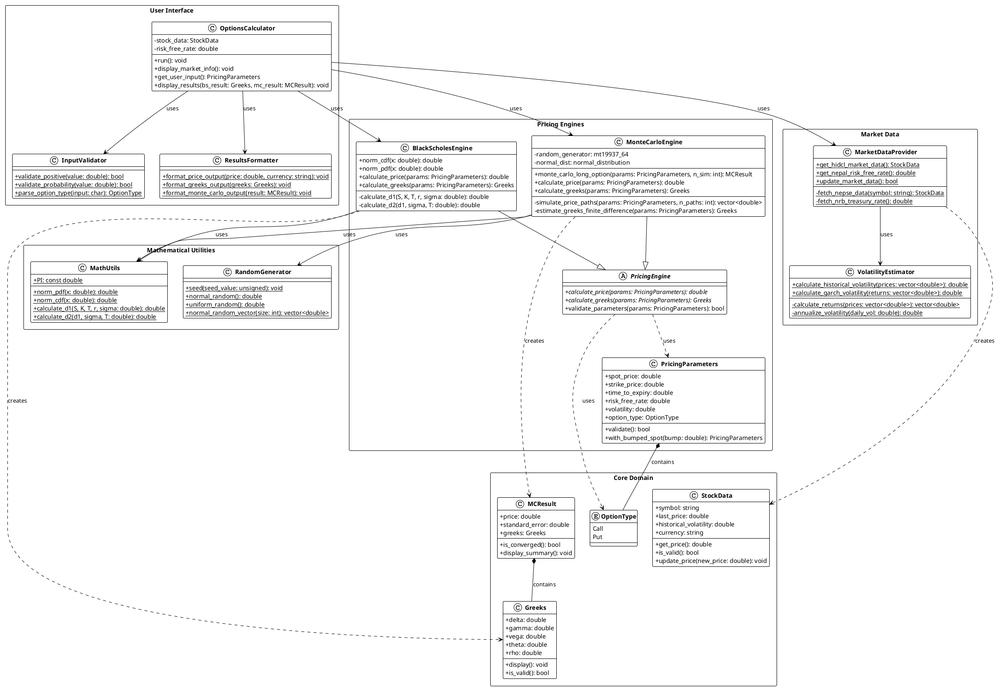
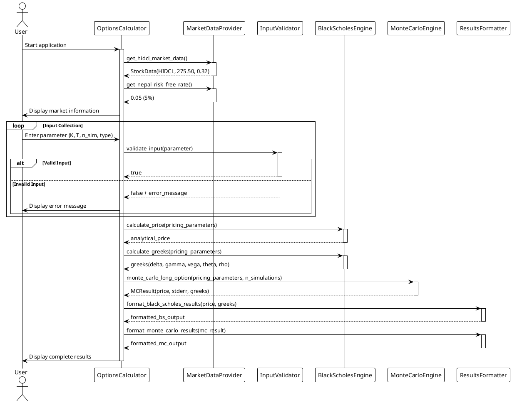
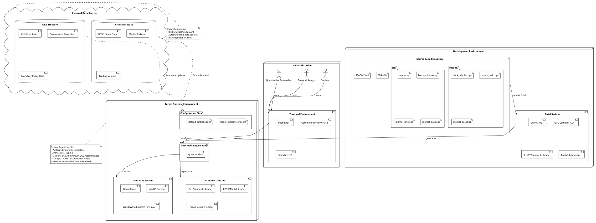
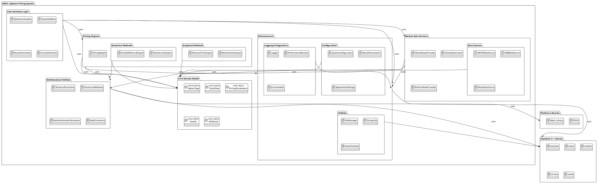
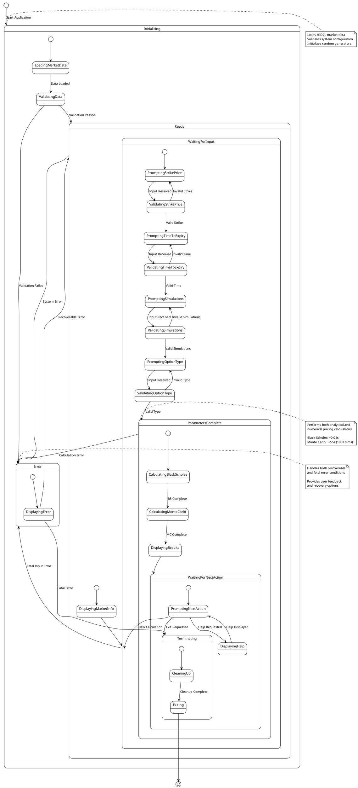

# HIDCL Options Pricing System
## Comprehensive UML Architecture Documentation
### Add EXCEPTION HANDLING
---

**Document Information**
| Field | Value |
|-------|--------|
| **Project Title** | HIDCL Options Pricing System - UML Architecture |
| **Document Type** | Technical Architecture Specification |
| **Date Created** | 2025-06-05 03:18:54 UTC |
| **Last Modified** | 2025-06-05 03:18:54 UTC |
| **Author** | User 4095e (Login: 4095e) |
| **Version** | 1.0 |
| **Status** | Draft for Review |
| **Classification** | Technical Documentation |

---

## Table of Contents

1. [Introduction](#1-introduction)
2. [System Overview](#2-system-overview)
3. [UML Diagrams](#3-uml-diagrams)
   - 3.1 [Class Diagram](#31-class-diagram)
   - 3.2 [Component Diagram](#32-component-diagram)
   - 3.3 [Sequence Diagram](#33-sequence-diagram)
   - 3.4 [Activity Diagram](#34-activity-diagram)
   - 3.5 [Deployment Diagram](#35-deployment-diagram)
   - 3.6 [Package Diagram](#36-package-diagram)
   - 3.7 [State Machine Diagram](#37-state-machine-diagram)
4. [Architecture Patterns](#4-architecture-patterns)
5. [Design Decisions](#5-design-decisions)
6. [Implementation Guidelines](#6-implementation-guidelines)

---

## 1. Introduction

### 1.1 Purpose

This document provides a comprehensive UML architecture specification for the **HIDCL Options Pricing System**, a sophisticated C++ quantitative finance application designed for pricing European long options on HIDCL stock within the Nepalese financial market context.

### 1.2 Scope

The architecture encompasses:
- Object-oriented design patterns and relationships
- Component interactions and dependencies
- Runtime behavior and message flows
- Deployment and physical architecture
- Package organization and modular structure

### 1.3 Audience

- Software architects and developers
- Project stakeholders and reviewers
- Academic researchers and students
- Quality assurance engineers

---

## 2. System Overview

### 2.1 System Context

The HIDCL Options Pricing System operates within the Nepalese financial market ecosystem, specifically targeting:

- **Primary Security:** HIDCL (Hydroelectricity Investment and Development Company Limited)
- **Market Context:** Nepal Stock Exchange (NEPSE)
- **Regulatory Environment:** Nepal Rastra Bank (NRB) guidelines
- **Currency:** Nepalese Rupees (NPR)

### 2.2 Key Requirements

| Requirement Category | Description |
|---------------------|-------------|
| **Functional** | Black-Scholes and Monte Carlo pricing, Greeks calculation |
| **Performance** | Sub-second pricing, 100K+ simulations in <5 seconds |
| **Usability** | Command-line interface, comprehensive validation |
| **Portability** | Cross-platform C++17 compatibility |
| **Maintainability** | Modular design, comprehensive documentation |

---

## 3. UML Diagrams

### 3.1 Class Diagram

The class diagram illustrates the object-oriented structure of the system, showing classes, their attributes, methods, and relationships.



### 3.2 Component Diagram

The component diagram shows the high-level architectural components and their interfaces.

```plantuml
@startuml HIDCL_Component_Diagram
!theme plain

package "HIDCL Options Pricing System" {
    component [User Interface] as UI {
        portin " - User Input"
        portout " - Formatted Results"
    }
    
    component [Pricing Engine] as Engine {
        portin " - Pricing Parameters"
        portout " - Calculated Prices & Greeks"
    }
    
    component [Market Data Provider] as Market {
        portin " - Data Requests"
        portout " - Market Information"
    }
    
    component [Mathematical Library] as Math {
        portin " - Calculation Requests"
        portout " - Mathematical Results"
    }
    
    component [Input Validation] as Validator {
        portin " - Raw Input"
        portout " - Validated Parameters"
    }
    
    component [Results Formatter] as Formatter {
        portin " - Raw Results"
        portout " - Formatted Output"
    }
}

database "Configuration Data" as Config {
    [Market Parameters]
    [Default Settings]
}

cloud "External Data Sources" as External {
    [NEPSE API] as NEPSE
    [NRB Treasury] as NRB
}

actor "User" as User
actor "Market Data Feed" as Feed

' Relationships
User --> UI : interacts
UI --> Validator : validates input
UI --> Engine : requests calculations
UI --> Formatter : formats output

Engine --> Math : uses functions
Engine --> Market : gets parameters

Market --> Config : reads settings
Market -.-> NEPSE : future integration
Market -.-> NRB : future integration

Feed -.-> External : provides data

note right of External
  Future integration planned
  Currently using static data
end note

@enduml
```

### 3.3 Sequence Diagram

The sequence diagram illustrates the typical interaction flow for option pricing calculation.



### 3.4 Activity Diagram

The activity diagram shows the complete workflow of the options pricing process.

```plantuml
@startuml HIDCL_Activity_Diagram
!theme plain

start

:Initialize System;
:Load HIDCL Market Data;
:Load Nepal Risk-Free Rate;
:Display Market Information;

partition "Input Collection" {
    :Prompt for Strike Price (K);
    :Read User Input K;
    
    if (K > 0?) then (yes)
    else (no)
        :Display Error: "Strike price must be positive";
        stop
    endif
    
    :Prompt for Time to Expiry (T);
    :Read User Input T;
    
    if (T > 0?) then (yes)
    else (no)
        :Display Error: "Time to expiry must be positive";
        stop
    endif
    
    :Prompt for Number of Simulations;
    :Read User Input n_sim;
    
    if (n_sim > 0?) then (yes)
    else (no)
        :Display Error: "Number of simulations must be positive";
        stop
    endif
    
    :Prompt for Option Type (c/p);
    :Read User Input option_type;
    
    if (option_type valid?) then (yes)
    else (no)
        :Display Error: "Invalid option type";
        stop
    endif
}

partition "Black-Scholes Calculation" {
    :Calculate d1 and d2 parameters;
    note right: d₁ = [ln(S/K) + (r + σ²/2)T] / (σ√T)
    
    :Calculate Option Price;
    note right
        Call: C = S×N(d₁) - K×e^(-rT)×N(d₂)
        Put: P = K×e^(-rT)×N(-d₂) - S×N(-d₁)
    end note
    
    :Calculate Greeks;
    note right
        Delta: Δ = N(d₁) for calls
        Gamma: Γ = φ(d₁)/(S×σ×√T)
        Vega: ν = S×φ(d₁)×√T
        Theta: Θ = -S×φ(d₁)×σ/(2√T) - r×K×e^(-rT)×N(d₂)
        Rho: ρ = K×T×e^(-rT)×N(d₂)
    end note
    
    :Display Black-Scholes Results;
}

partition "Monte Carlo Simulation" {
    :Initialize Random Generator;
    :Set simulation_count = 0;
    :Initialize payoff_sum = 0;
    :Initialize greeks_sum = 0;
    
    repeat
        :Generate Random Number Z ~ N(0,1);
        :Calculate Final Stock Price;
        note right: S(T) = S₀ × exp((r - σ²/2)T + σ√T × Z)
        
        :Calculate Option Payoff;
        note right
            Call: max(S(T) - K, 0)
            Put: max(K - S(T), 0)
        end note
        
        :Estimate Greeks (Finite Difference);
        :Add to running sums;
        :Increment simulation_count;
    repeat while (simulation_count < n_simulations)
    
    :Calculate Average Payoff and Greeks;
    :Calculate Standard Error;
    note right: SE = √(Var(Payoffs)/n_simulations)
    
    :Discount to Present Value;
    note right: PV = e^(-rT) × Average_Payoff
    
    :Display Monte Carlo Results;
}

:Display Completion Message;
:Display Educational Notes;

stop

@enduml
```



### 3.5 Deployment Diagram

The deployment diagram shows the physical deployment architecture and runtime environment.



### 3.6 Package Diagram

The package diagram illustrates the logical organization and dependencies between different modules.



### 3.7 State Machine Diagram

The state machine diagram shows the application lifecycle and user interaction states.



---

## 4. Architecture Patterns

### 4.1 Design Patterns Used

| Pattern | Usage | Benefits |
|---------|-------|----------|
| **Strategy Pattern** | Pricing engines (BlackScholes vs MonteCarlo) | Interchangeable algorithms |
| **Factory Pattern** | Creating pricing engines and market data providers | Flexible object creation |
| **Template Method** | Base pricing engine with customizable steps | Code reuse and consistency |
| **Observer Pattern** | Market data updates and notifications | Loose coupling |
| **Singleton Pattern** | Configuration and logging services | Global access control |
| **Command Pattern** | User input handling and validation | Undo/redo capability |

### 4.2 Architectural Patterns

#### 4.2.1 Layered Architecture

```
┌─────────────────────────────────────┐
│        Presentation Layer          │  ← User Interface, Input/Output
├─────────────────────────────────────┤
│        Business Logic Layer        │  ← Pricing Engines, Calculations
├─────────────────────────────────────┤
│        Data Access Layer           │  ← Market Data, Configuration
├─────────────────────────────────────┤
│        Infrastructure Layer        │  ← Math Libraries, Utilities
└─────────────────────────────────────┘
```

#### 4.2.2 Dependency Injection

- **Interface Segregation:** Small, focused interfaces for pricing engines
- **Dependency Inversion:** High-level modules don't depend on low-level modules
- **Constructor Injection:** Dependencies provided at object creation
- **Service Locator:** Central registry for service discovery

### 4.3 SOLID Principles Application

| Principle | Implementation |
|-----------|----------------|
| **S** - Single Responsibility | Each class has one reason to change |
| **O** - Open/Closed | Extensible pricing engines via interfaces |
| **L** - Liskov Substitution | Pricing engines interchangeable |
| **I** - Interface Segregation | Focused, minimal interfaces |
| **D** - Dependency Inversion | Abstractions over concrete implementations |

---

## 5. Design Decisions

### 5.1 Technology Choices

| Decision | Rationale | Alternatives Considered |
|----------|-----------|------------------------|
| **C++17** | Performance, mathematical libraries, academic standard | Python (slower), Java (GC overhead) |
| **Static Linking** | Self-contained deployment | Dynamic linking (dependency issues) |
| **Command Line Interface** | Simplicity, scriptability | GUI (complexity), Web interface (scope) |
| **Header-only Math** | Compilation simplicity | External libraries (dependencies) |

### 5.2 Mathematical Model Choices

#### 5.2.1 Black-Scholes Implementation

**Decision:** Use analytical closed-form solutions
**Rationale:** 
- Exact results for European options
- Sub-millisecond calculation time
- Educational value for understanding

**Mathematical Foundation:**
```
Call Price: C = S₀N(d₁) - Ke^(-rT)N(d₂)
Put Price:  P = Ke^(-rT)N(-d₂) - S₀N(-d₁)

Where:
d₁ = [ln(S₀/K) + (r + σ²/2)T] / (σ√T)
d₂ = d₁ - σ√T
```

#### 5.2.2 Monte Carlo Implementation

**Decision:** Use Geometric Brownian Motion with variance reduction
**Rationale:**
- Flexibility for future enhancements
- Educational demonstration of numerical methods
- Greeks estimation via finite differences

**Mathematical Foundation:**
```
Stock Price Path: S(T) = S₀ × exp((r - σ²/2)T + σ√T × Z)
Where Z ~ N(0,1)

Option Payoff:
Call: max(S(T) - K, 0)
Put:  max(K - S(T), 0)

Present Value: PV = e^(-rT) × E[Payoff]
```

### 5.3 Error Handling Strategy

| Error Type | Handling Approach | Example |
|------------|------------------|---------|
| **Input Validation** | Immediate feedback with retry | Negative strike price |
| **Numerical Errors** | Graceful degradation | Overflow in calculations |
| **System Errors** | Logging with fallback | File I/O failures |
| **Configuration Errors** | Default values with warnings | Missing parameters |

---

## 6. Implementation Guidelines

### 6.1 Coding Standards

#### 6.1.1 Naming Conventions

| Element | Convention | Example |
|---------|------------|---------|
| **Classes** | PascalCase | `BlackScholesEngine` |
| **Methods** | camelCase | `calculatePrice()` |
| **Variables** | snake_case | `risk_free_rate` |
| **Constants** | UPPER_SNAKE_CASE | `DEFAULT_SIMULATIONS` |
| **Files** | snake_case | `black_scholes.hpp` |

#### 6.1.2 Documentation Standards

- **Header Comments:** File purpose, author, date
- **Class Comments:** Responsibility and usage
- **Method Comments:** Parameters, return values, exceptions
- **Inline Comments:** Complex algorithms and formulas

#### 6.1.3 Mathematical Formulas Documentation

```cpp
/**
 * Calculates Black-Scholes call option price
 * 
 * Formula: C = S₀N(d₁) - Ke^(-rT)N(d₂)
 * Where:
 *   d₁ = [ln(S₀/K) + (r + σ²/2)T] / (σ√T)
 *   d₂ = d₁ - σ√T
 *   
 * @param S Current stock price
 * @param K Strike price
 * @param T Time to expiration (years)
 * @param r Risk-free rate (annual)
 * @param sigma Volatility (annual)
 * @return Call option price
 */
double black_scholes_call(double S, double K, double T, double r, double sigma);
```

### 6.2 Testing Strategy

#### 6.2.1 Unit Testing

| Component | Test Coverage | Validation Method |
|-----------|---------------|-------------------|
| **Mathematical Functions** | 100% | Known analytical results |
| **Pricing Engines** | 95%+ | Cross-validation with external tools |
| **Input Validation** | 100% | Boundary and edge cases |
| **Market Data** | 90%+ | Mock data and error conditions |

#### 6.2.2 Integration Testing

- **End-to-end workflows** with realistic scenarios
- **Performance benchmarks** for pricing calculations
- **Cross-platform compatibility** testing
- **Memory leak detection** and profiling

#### 6.2.3 Acceptance Testing

- **Educational use cases** with documented examples
- **HIDCL-specific scenarios** with market data
- **User interface workflows** and error handling
- **Documentation accuracy** and completeness

### 6.3 Performance Optimization

#### 6.3.1 Computational Efficiency

| Optimization | Technique | Expected Improvement |
|--------------|-----------|---------------------|
| **Mathematical Functions** | Lookup tables for normal distribution | 2-3x faster |
| **Monte Carlo** | Vectorized operations | 1.5-2x faster |
| **Memory Management** | Object pooling for simulations | Reduced GC pressure |
| **Compiler Optimizations** | -O3 optimization flags | 20-30% improvement |

#### 6.3.2 Scalability Considerations

- **Parallel Monte Carlo** simulations for large path counts
- **Batch processing** for multiple option calculations
- **Memory-efficient** path generation for large simulations
- **Configurable precision** vs. performance trade-offs

---

## 7. Quality Assurance

### 7.1 Code Quality Metrics

| Metric | Target | Measurement |
|--------|--------|-------------|
| **Code Coverage** | >90% | Unit and integration tests |
| **Cyclomatic Complexity** | <10 per method | Static analysis tools |
| **Documentation Coverage** | >95% | API documentation completeness |
| **Performance Benchmarks** | Meet SLA targets | Automated performance tests |

### 7.2 Review Process

#### 7.2.1 Design Review Checklist

- [ ] Architecture follows documented patterns
- [ ] Mathematical formulas correctly implemented
- [ ] Error handling comprehensive and consistent
- [ ] Performance requirements met
- [ ] Security considerations addressed
- [ ] Documentation complete and accurate

#### 7.2.2 Code Review Checklist

- [ ] Coding standards compliance
- [ ] Unit tests comprehensive
- [ ] Mathematical accuracy validated
- [ ] Error conditions handled
- [ ] Memory management correct
- [ ] Thread safety considered

---

## 8. Conclusion

### 8.1 Architecture Summary

The HIDCL Options Pricing System architecture provides a robust, extensible foundation for quantitative finance applications in the Nepalese market context. The design emphasizes:

- **Modularity:** Clear separation of concerns with well-defined interfaces
- **Extensibility:** Plugin architecture for future pricing models
- **Performance:** Optimized mathematical computations and efficient algorithms
- **Maintainability:** Comprehensive documentation and testing framework
- **Educational Value:** Clear implementation of financial concepts

### 8.2 Future Architectural Considerations

| Enhancement | Architectural Impact | Timeline |
|-------------|---------------------|----------|
| **Real-time Data Feeds** | New data layer components | 6 months |
| **Web Interface** | Additional presentation layer | 12 months |
| **Multi-threading** | Concurrent processing architecture | 9 months |
| **Database Integration** | Persistent storage layer | 8 months |

---

**Document Control**

| Field | Value |
|-------|--------|
| **Document Version** | 1.0 |
| **Created** | 2025-06-05 03:18:54 UTC |
| **Last Modified** | 2025-06-05 03:18:54 UTC |
| **Author** | User 4095e (Login: 4095e) |
| **Review Status** | Draft |
| **Next Review** | 2025-06-12 |
| **Distribution** | Architecture team, stakeholders |

---

**Confidentiality Notice**
This document contains technical architecture specifications for educational and research purposes. Distribution should maintain academic integrity and proper attribution.

---

*End of Architecture Documentation*
